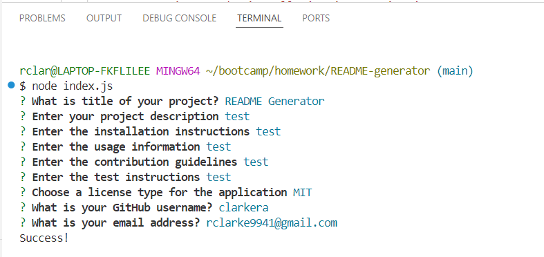
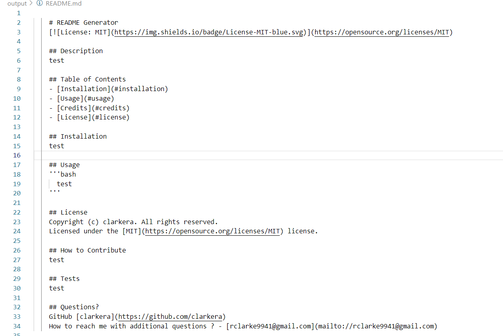

# README Generator

## Description
This application was created using node.js to create professional README.md docs from the command line.It was created to reduce the amount of time developers are using to write README.md files. This gives developers more time for creating and maintaining their applications. 

## Video Link 
https://youtu.be/KG5xstepmvA 

## Screenshots

